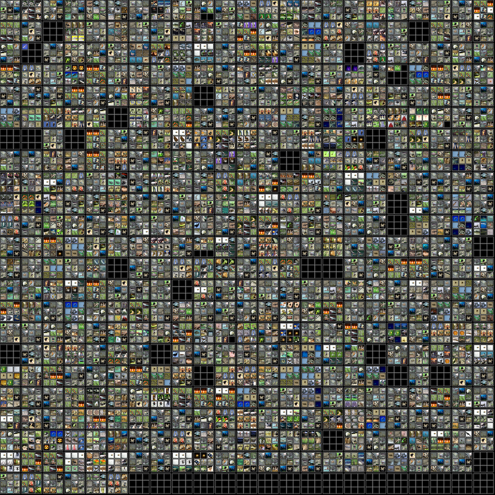

# dump_featuremaps
Dump featuremaps at a given layer, side-by-side with input image, in addition to creating of montages of the 16- 'best' images and activations (with exciting positive activations) for each feature map.

# Usage
```
   dump_featuremaps.py 
   --image_dir_root   A directory with subdirs for classes, e.g. '601' and '709'
   --image_list_file  Image list file, like those used to build RecordIO databases
   --checkpoint_path  Path of checkpoint folder
   --epoch            Epoch number to be listed 
   --layer_name       Name of the layer to output, e.g. _plus2_output
```
### --image_dir_root Note

This script does not yet support any type of image name. For now, variables like 'pattern' and 'm' will have to be changed according to the names of the images you are using for each class.

# Best Images Example


# License

MIT © Larry Pearlstein, Alex Benasutti
